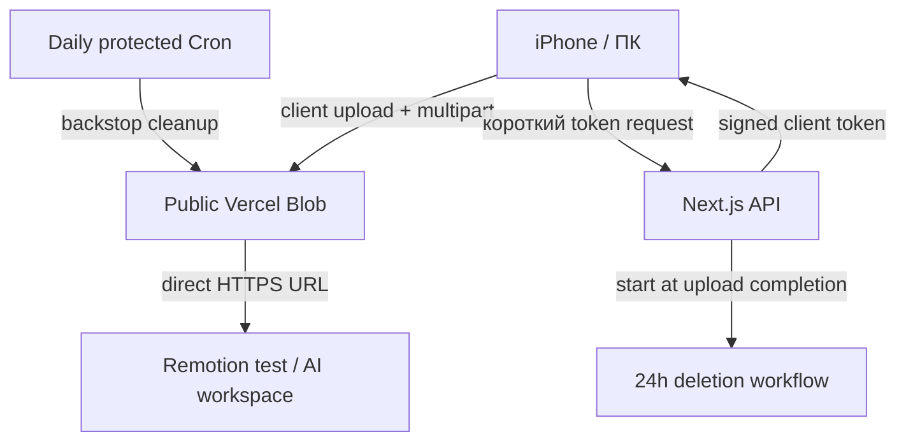

# VideoBridge

Персональный мост `iPhone/ПК → Vercel Blob → Remotion`. Приложение загружает исходное видео напрямую из браузера в public Vercel Blob, выдаёт прямой HTTPS URL и формирует ZIP fallback без перекодирования и без второй копии видео в storage.

## Что реализовано

- MP4, MOV и WebM до 1 ГБ;
- browser → Blob client upload: видео не проходит через Vercel Function;
- multipart upload для файлов больше 100 МБ, прогресс, отмена и повторная попытка;
- случайный UUID в pathname и отсутствие публичного каталога;
- проверка `HEAD + range GET`, HTTP status, `Content-Type`, `Content-Length` и защита от HTML вместо видео;
- прямой URL, готовый Remotion prompt, Clipboard и Web Share API;
- ZIP по запросу: `source-video.*`, `manifest.json`, `README.txt`;
- client-side metadata: duration, width, height, когда браузер способен прочитать контейнер;
- ручное удаление с HMAC ownership token;
- точное удаление через 24 часа через Vercel Workflow и ежедневный Cron как backstop;
- personal access key, MIME/extension validation и best-effort IP rate limit;
- PWA manifest, iPhone standalone mode, safe-area layout и большие touch targets;
- тестовый Remotion renderer, который скачивает URL, запускает ffprobe и рендерит короткий MP4.

## Архитектура



Большой request body никогда не отправляется в Next.js Route Handler. API обрабатывает только JSON/token requests, проверку ссылки и команды удаления.

## Environment variables

Скопируйте `.env.example` в `.env.local` и заполните:

| Key | Назначение |
|---|---|
| `BLOB_READ_WRITE_TOKEN` | Автоматически создаётся/подключается Vercel Blob Store |
| `VIDEOBRIDGE_ACCESS_KEY` | Персональный код, который вводится в интерфейсе |
| `VIDEOBRIDGE_SIGNING_SECRET` | Случайная строка минимум 32 байта для HMAC delete token |
| `CRON_SECRET` | Случайная строка минимум 32 байта; Vercel передаёт её Cron route |

Секреты не должны иметь префикс `NEXT_PUBLIC_` и не попадают в frontend bundle.

## Локальный запуск

```bash
npm install
npm run dev
```

Без реального `BLOB_READ_WRITE_TOKEN` интерфейс и unit tests работают, но загрузка в Blob — нет.

## Проверки

```bash
npm run qa
```

Команда выполняет ESLint, TypeScript, Vitest и production build. ZIP-тест открывает архив системным `unzip` и сравнивает байты исходника после извлечения.

## Remotion compatibility test

Тест принимает direct URL, выполняет полный GET на диск, сверяет размер, читает metadata через `ffprobe`, вставляет локальный файл в composition и рендерит до трёх секунд H.264 MP4.

```bash
VIDEO_URL="https://...blob.vercel-storage.com/uploads/.../source-video.mp4" npm run remotion:test
```

Результат:

```text
remotion-test/output/videobridge-remotion-test.mp4
```

В репозиторий включён совместимый Chromium Headless Shell из npm-пакета `@sparticuz/chromium`, поэтому QA не зависит от установленного в системе Chrome.

## Deployment на Vercel

1. Импортируйте GitHub-репозиторий как новый Vercel project.
2. В `Storage` создайте Vercel Blob Store с public access и подключите его к проекту.
3. Добавьте три персональных секрета из таблицы выше для Production, Preview и Development.
4. Deploy. Git integration будет создавать Preview для веток и Production для `main`.
5. Проверьте `/api/health`: `{"ok":true,"configured":true}`.
6. Загрузите тестовый файл и запустите Remotion test с полученным URL.

`vercel.json` содержит ежедневный Cron, совместимый с Hobby plan. Основное удаление ровно через 24 часа выполняет Vercel Workflow; Cron удаляет просроченные объекты, если callback/workflow не был запущен.

## Cleanup

После upload completion Blob callback запускает `deleteUploadAtExpiry()`:

1. workflow засыпает до `expiresAt` без потребления compute;
2. step удаляет Blob;
3. ручная кнопка может удалить его раньше;
4. ежедневный `/api/cleanup` сканирует только внутренний prefix `uploads/` и удаляет всё старше 24 часов.

Ни один endpoint не возвращает список uploads клиенту.

## Ограничения

- Public URL является bearer-like ссылкой: любой, кто получил URL, может читать файл до удаления.
- Встроенный iOS/Safari ZIP fallback создаётся потоково, но финальный browser `Blob` может потребовать память примерно с размер архива. Для очень больших файлов надёжнее скачивать ZIP на ПК; direct URL остаётся главным путём.
- MOV/HEVC может не читаться некоторыми браузерами для client metadata, поэтому поля duration/width/height допускают `null`. Remotion QA использует ffprobe и определяет metadata независимо.
- In-memory IP rate limit — дополнительная защита. Основная защита upload token endpoint — персональный access key, ограничения MIME/размера и подписанный pathname.
